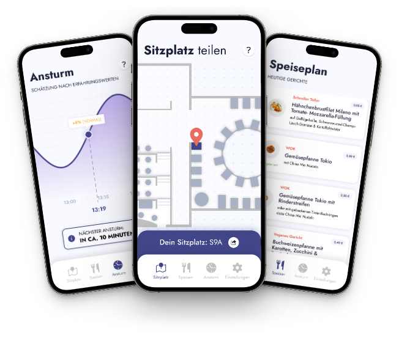

# Mensa PWA

The Mensa PWA is an progressive web application designed to assist HTWK Leipzig students in locating their friends at the Mensa Academica and exploring the day's meal offerings.

## Installation and Execution

### Prerequisites
* Docker
* Docker Compose

### Installation
Navigate to the project directory and execute the following commands based on your environment:
* For development: `docker-compose -f docker-compose.dev.yml up -d`
* For production (requires traefik service): `docker-compose -f docker-compose.prod.yml up -d`
* For local production: `docker-compose -f docker-compose.local-prod.yml up -d`

After starting the services, they can be accessed on the following ports and URLs:
* `client`: Accessible at `http://localhost:3000` when running the development docker-compose command, else accessible at `http://localhost:80` and `https://localhost:443`
* `app server`: Accessible at `http://localhost:4000`

### Developing the React Frontend Independently
If no backend infrastructure is needed and only the React frontend wants to be developed, navigate to the client folder and execute the following commands:
* `npm install`
* `npm start`

This requires Node.js and npm to be installed on your machine.

### Infrastructure
The application consists of the following services:
* `client`: The React frontend of the application.
* `db`: The mongodb database service.
* `app`: The application server.
* `nightly`: A Python-based backend service that performs tasks in the night such as generating preview images for the Mensa food and estimating the nutrition in the food, based on OpenAI.

### Environment Variables
The following environment variables are required:
* `OPENAI_API_KEY`: Can be obtained from https://platform.openai.com/account/api-keys. Needed to generate the AI images and nutrition estimation.
* `VAPID_PRIVATE_KEY`: Can be generated using a VAPID key generator (needed for webpush notifications).
* `VAPID_PUBLIC_KEY`: Can be generated using a VAPID key generator (needed for webpush notifications).

For deployment, the following additional environment variables are required and are best stored in the repository:
* `DOCKER_PASSWORD`: This is your Docker account password. It's needed to pull and push images from Docker Hub.
* `DOCKER_USERNAME`: This is your Docker account username. It's needed to authenticate with Docker Hub.
* `SERVER_HOST`: This is the IP address or domain name of your server. It's needed to know where to deploy the application.
* `SERVER_USERNAME`: This is the username of your server. It's needed to authenticate with the server.
* `SSH_KEY`: This is the private SSH key corresponding to the public key added to your server. It's needed to establish a secure connection with the server.

### Deployment
The application is automatically deployed to a server defined in the environment variables whenever changes are pushed to the `prod` branch. This is done using a GitHub Actions pipeline defined in `.github/workflows/main.yml`. This setup requires a Traefik instance on the server.

## Authors

* Linus Herterich
* Jonas Gwozdz

## License

This project is licensed under the MIT License - see the [LICENSE](LICENSE.txt) file for details.